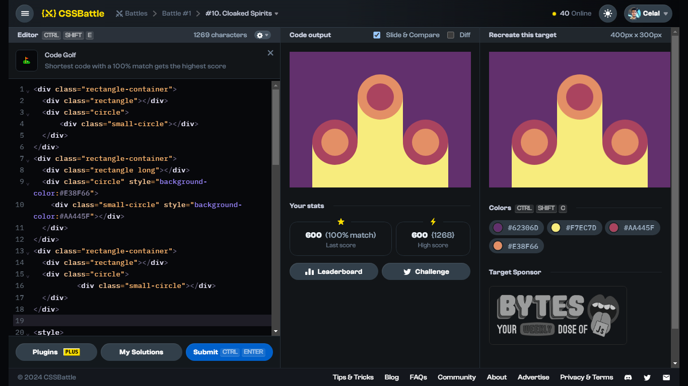

# Battle #1 - Pilot Battle

## #10 - Cloaked Spirits

[Link to the problem](https://cssbattle.dev/play/10)



```html
<div class="rectangle-container">
  <div class="rectangle"></div>
  <div class="circle">
      <div class="small-circle"></div>
  </div>
</div>
<div class="rectangle-container">
  <div class="rectangle long"></div>
  <div class="circle" style="background-color:#E38F66">
    <div class="small-circle" style="background-color:#AA445F"></div>
  </div>
</div>
<div class="rectangle-container">
  <div class="rectangle"></div>
  <div class="circle">
          <div class="small-circle"></div>
  </div>
</div>

<style>
  body {
    background: #62306D;
    margin: 0;
    display: flex;
    flex-direction: row;
    justify-content: center;
  }

  .rectangle-container {
    display: flex;
    flex-direction: column-reverse;
    align-items: flex-end;
    width: 100px;
    height: 300px;
  }
  
  .rectangle {
    width: 100px;
    height: 100px;
    background: #F7EC7D;
  }

  .circle {
    width: 100px;
    height: 100px;
    border-radius: 100px;
    margin-bottom: -50px;
    background: #AA445F;
    z-index: 1;
    display: flex;
    flex-direction: row;
    justify-content: center;
    align-items: center;
  }

  .small-circle {
    width: 60px;
    height: 60px;
    border-radius: 60px;
    background: #E38F66;
  }

  .long {
    height: 200px;
  }
</style>
```