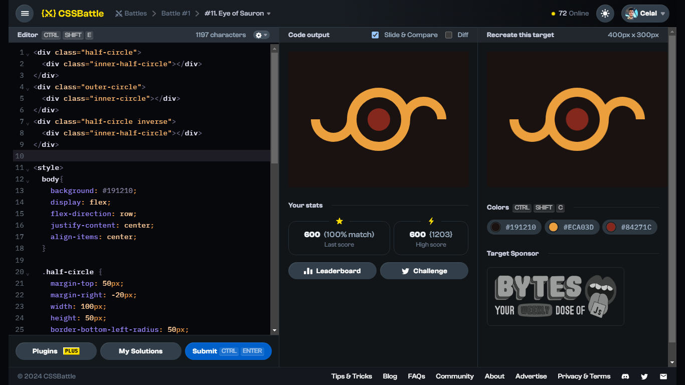

# Battle #1 - Pilot Battle

## #11 - Eye of Sauron

[Link to the problem](https://cssbattle.dev/play/11)



```html
<div class="half-circle">
  <div class="inner-half-circle"></div>
</div>
<div class="outer-circle">
  <div class="inner-circle"></div>
</div>
<div class="half-circle inverse">
  <div class="inner-half-circle"></div>
</div>

<style>
  body{
    background: #191210;
    display: flex;
    flex-direction: row;
    justify-content: center;
    align-items: center;
  }
  
  .half-circle {
    margin-top: 50px;
    margin-right: -20px;
    width: 100px;
    height: 50px;
    border-bottom-left-radius: 50px;
    border-bottom-right-radius: 50px;
    background: #ECA03D;
    display: flex;
    justify-content: center;
  }

  .inner-half-circle {
    width: 60px;
    height: 30px;
    border-bottom-left-radius: 50px;
    border-bottom-right-radius: 50px;
    background: #191210;
  }

  .outer-circle {
    width: 140px;
    height: 140px;
    border-radius: 100px;
    background: #ECA03D;
    display: flex;
    align-items: center;
    justify-content: center;
  }

  .inner-circle {
    width: 50px;
    height: 50px;
    border-radius: 100px;
    border: 25px solid #191210;
    background: #84271C;
  }

  .inverse {
    transform: scale(1, -1);
    margin: 0px 0px 50px -20px;
  }
</style>
```