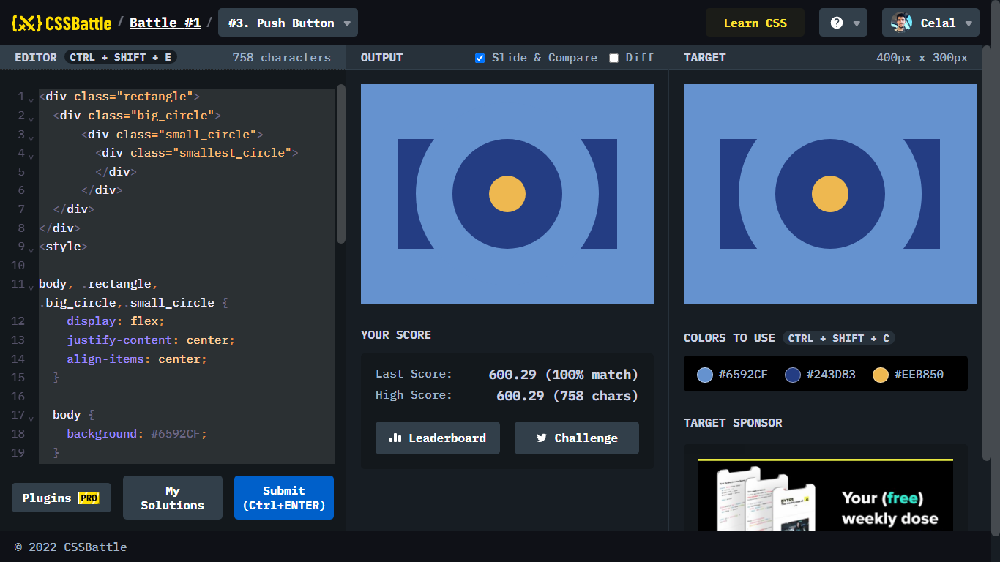

# Battle #1 - Pilot Battle

## #3 - Push Button

[Link to the problem](https://cssbattle.dev/play/3)



```html
<div class="rectangle">
  <div class="big_circle">
      <div class="small_circle">
        <div class="smallest_circle">
        </div>
      </div>
  </div>
</div>
<style>
  
body, .rectangle, .big_circle,.small_circle {
    display: flex;
    justify-content: center;
    align-items: center;
  }
  
  body {
    background: #6592CF;
  }

  .rectangle{
    width: 300px;
    height: 150px;
    background: #243D83;
  }

  .big_circle{
    width: 250px;
    height: 250px;
    border-radius: 250px;
    background: #6592CF;
  }

  .small_circle{
    width: 150px;
    height: 150px;
    border-radius: 150px;
    background: #243D83;
  }

  .smallest_circle{
    width: 50px;
    height: 50px;
    border-radius: 50px;
    background: #EEB850;
  }
</style>
```