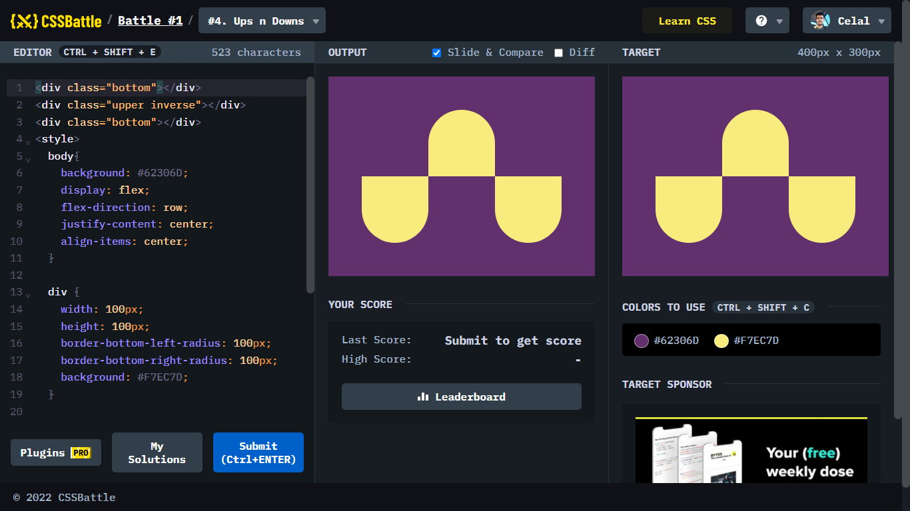

# Battle #1 - Pilot Battle

## #4 - Ups n Downs

[Link to the problem](https://cssbattle.dev/play/4)



```html
<div class="bottom"></div>
<div class="upper inverse"></div>
<div class="bottom"></div>
<style>
  body{
    background: #62306D;
    display: flex;
    flex-direction: row;
    justify-content: center;
    align-items: center;
  }
  
  div {
    width: 100px;
    height: 100px;
    border-bottom-left-radius: 100px;
    border-bottom-right-radius: 100px;
    background: #F7EC7D;
  }

  .upper{
      margin-bottom: 100px;
  }

  .bottom{
      margin-top: 100px;
  }

  .inverse{
    transform: scale(1, -1);
  }
</style>
```