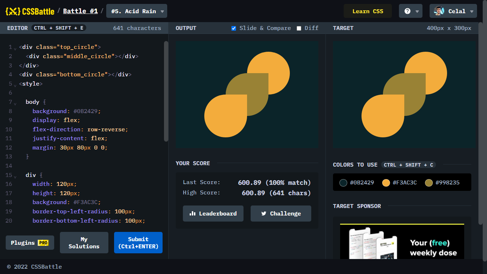

# Battle #1 - Pilot Battle

## #5 - Acid Rain

[Link to the problem](https://cssbattle.dev/play/5)



```html
<div class="top_circle">
  <div class="middle_circle"></div>
</div>
<div class="bottom_circle"></div>
<style>
  
  body {
    background: #0B2429;
    display: flex;
    flex-direction: row-reverse;
    justify-content: flex;
    margin: 30px 80px 0 0;
  }
  
  div {
    width: 120px;
    height: 120px;
    background: #F3AC3C;
    border-top-left-radius: 100px;
    border-bottom-left-radius: 100px;
    border-bottom-right-radius: 100px;
  }
  
  .top_circle{
    border-top-right-radius: 100px;
  }
  
  .bottom_circle{
    margin: 120px 0 0 0;
  }
  
  .middle_circle{
    margin: 60px 0 0 -60px;
    background: #998235;
  }
</style>
```