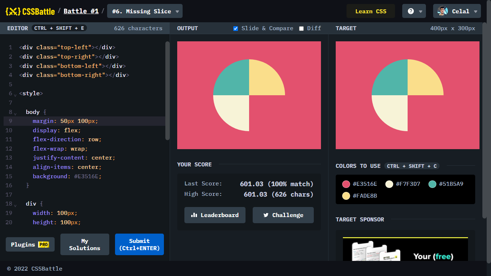

# Battle #1 - Pilot Battle

## #6 - Missing Slice

[Link to the problem](https://cssbattle.dev/play/6)



```html
<div class="top-left"></div>
<div class="top-right"></div>
<div class="bottom-left"></div>
<div class="bottom-right"></div>

<style>
  
  body {
    margin: 50px 100px;
    display: flex;
    flex-direction: row;
    flex-wrap: wrap;
    justify-content: center;
    align-items: center;
    background: #E3516E;
  }
  
  div {
    width: 100px;
    height: 100px;
  }
  
  .top-left{
    background: #51B5A9;
    border-top-left-radius: 100px;
  }
  
  .top-right{
    background: #FADE8B;
    border-top-right-radius: 100px;
  }
  
  .bottom-left{
    background: #F7F3D7;
    border-bottom-left-radius: 100px;
  }
</style>
```