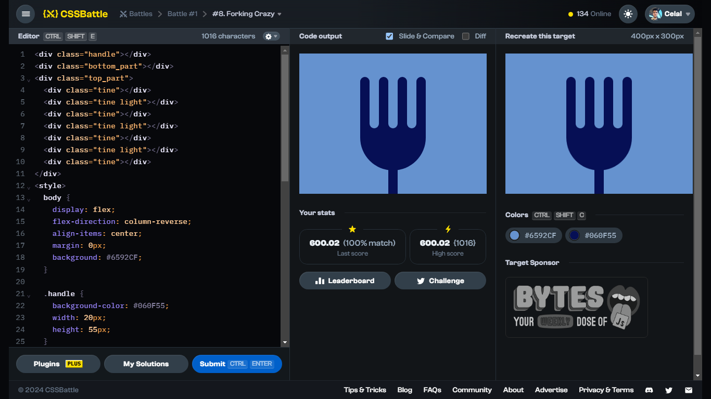

# Battle #1 - Pilot Battle

## #8 - Forking Crazy

[Link to the problem](https://cssbattle.dev/play/8)



```html
<div class="handle"></div>
<div class="bottom_part"></div>
<div class="top_part">
  <div class="tine"></div>
  <div class="tine light"></div>
  <div class="tine"></div>
  <div class="tine light"></div>
  <div class="tine"></div>
  <div class="tine light"></div>
  <div class="tine"></div>
</div>
<style>
  body {
    display: flex;
    flex-direction: column-reverse;
    align-items: center;
    margin: 0px;
    background: #6592CF;
  }

  .handle {
    background-color: #060F55;
    width: 20px;
    height: 55px;
  }

  .bottom_part {
    background-color: #060F55;
    width: 140px;
    height: 100px;
    border-bottom-left-radius: 70px;
    border-bottom-right-radius: 70px;
    margin-bottom: -5px;
  }

  .top_part{
    width: 140px;
    height: 120px;
    margin-bottom: -20px;
    z-index: 1;
    display: flex;
    flex-direction: row;
  }

  .tine {
    background-color: #060F55;
    width: 20px;
    height: 110px;
    border-radius: 20px;
  }

  .light {
    background-color: #6592CF;
  }

</style>
```