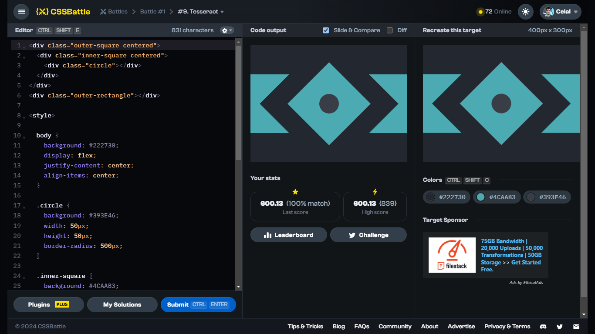

# Battle #1 - Pilot Battle

## #8 - Tesseract

[Link to the problem](https://cssbattle.dev/play/9)



```html
<div class="outer-square centered">
  <div class="inner-square centered">
    <div class="circle"></div>
  </div>
</div>
<div class="outer-rectangle"></div>

<style>
  
  body {
    background: #222730;
    display: flex;
    justify-content: center;
    align-items: center;
  }

  .circle {
    background: #393E46;
    width: 50px;
    height: 50px;
    border-radius: 500px;
  }

  .inner-square {
    background: #4CAAB3;
    width: 150px;
    height: 150px;
  }

  .outer-square {
    background: #222730;
    width: 250px;
    height: 250px;
    transform: rotate(45deg);
  }

  .outer-rectangle {
    position: absolute;
    top: 75px;
    width: 400px;;
    height: 150px;
    background: #4CAAB3;
    z-index: -1;
  }
  
  .centered {
    display: flex;
    justify-content: center;
    align-items: center;
  }
</style>
```